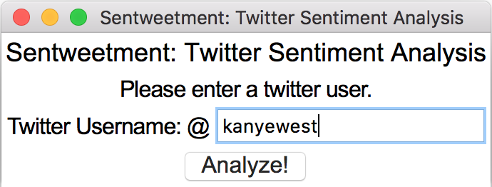
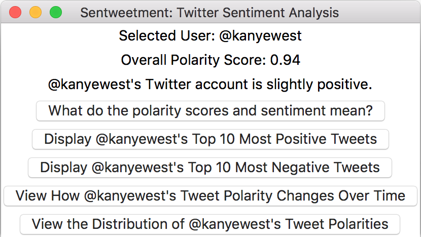
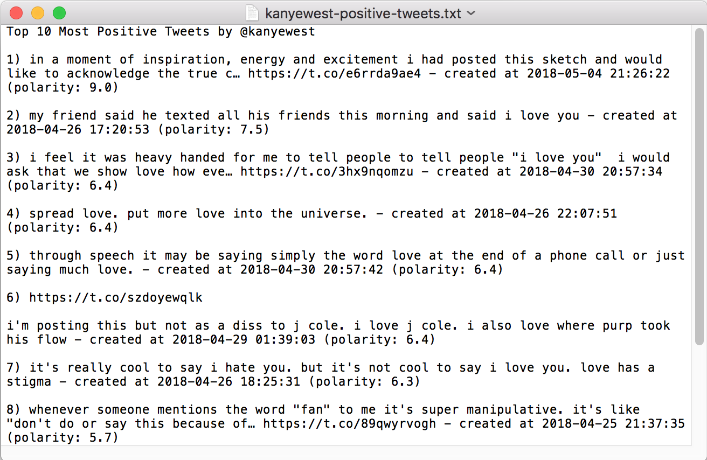
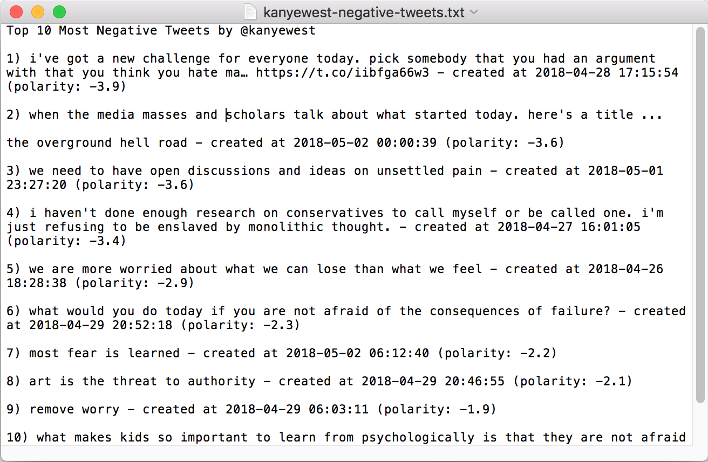
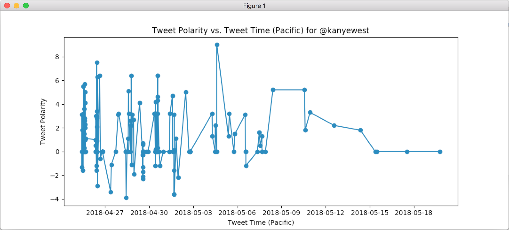
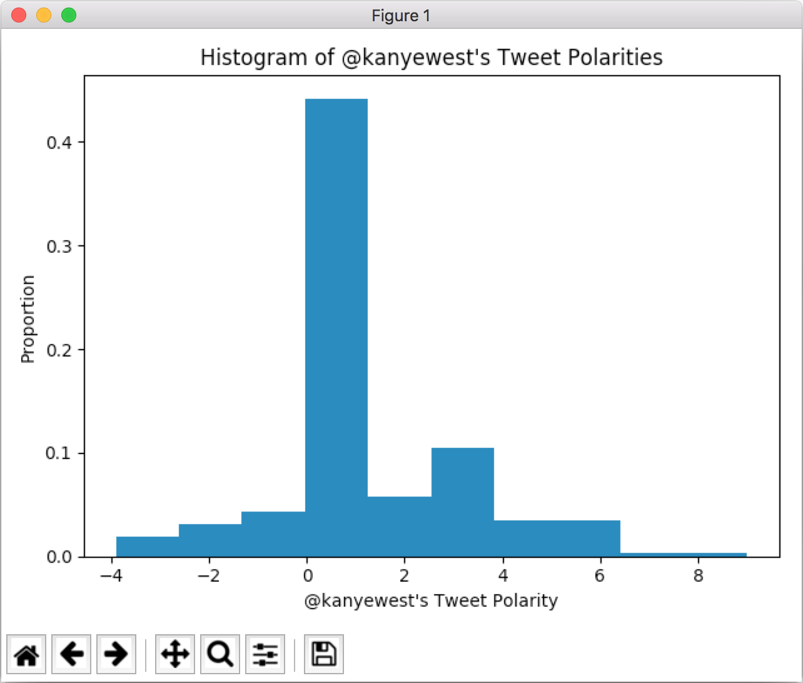

# Sentweetment: GUI Walkthrough

This page will give you a brief overview of how Sentweetment works, and examples of its GUI.

**Home Page**

This is the main home page of Sentweetment. It has a simple applet label, and prompts the user to enter a Twitter handle (username). If there is a ``tweepy`` error in retrieving the Twitter data for the selected Twitter user, then an error will be thrown, asking the user to double check if the Twitter username actually exists.

 

**Analysis Page**

This page opens once the user has entered in a valid Twitter username. It displays the average tweet polarity for the selected user, and the corresponding general sentiment of that account (based on the past 200 tweets). The average polarity is a simple arithmetic mean of all the polarity values in the ``tweepy`` data frame (see [tweets.py](../tweets.py)), and the general sentiment is obtained using [this scale](../analysis.py). This page also gives the users 5 button options: the first displays a [.txt file](../data/help.txt) that explains the methodology of obtaining the account polarity/sentiment; the second and third display the top 10 most positive/negative tweets by the selected user by opening a .txt file; the fourth displays a trend graph of tweet polarity vs. tweet time (visuals need improvement); and, the fifth displays a proportion histogram of tweet polarities.

 

The .txt file that opens if the user clicks the "Display Top 10 Most Positive Tweets" button.

 

The .txt file that opens if the user clicks the "Display Top 10 Most Negative Tweets" button.

 

The ``matplotlib`` trend graph that opens if the user clicks the "View How Tweet Polarity Changes Over Time" button; the visuals need improvement for better clarity.

 

The ``matplotlib`` proportion histogram that opens if the user clicks the "View the Distribution of Tweet Polarities" button.
